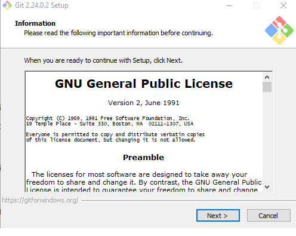
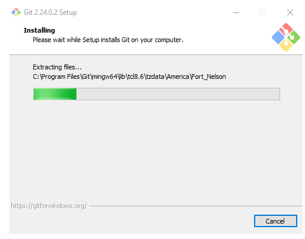
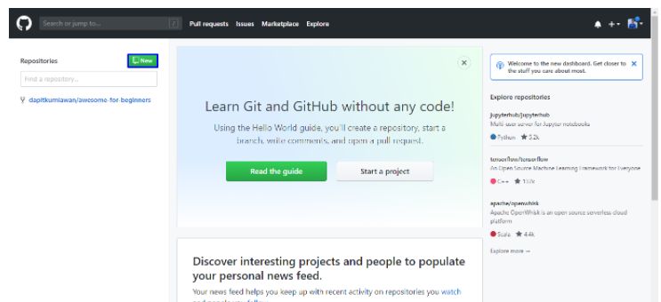
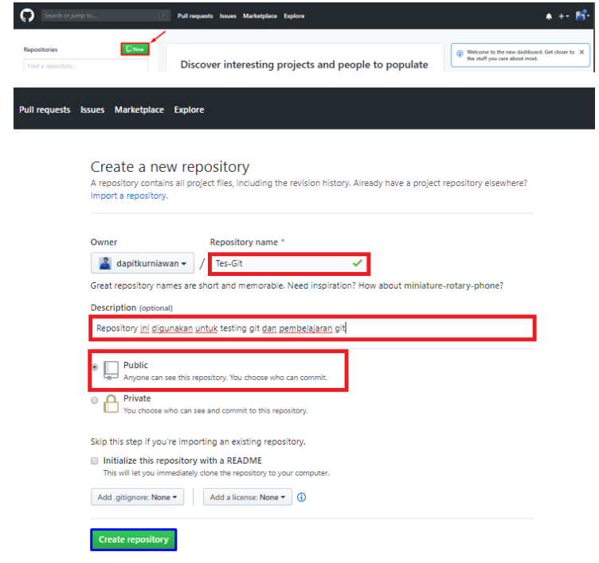

# Belajar Git
## Tutorial cara menggunakan git

### Instal Git 
Oke yang pertama tama kita donwload aplikasi terlebih dahulu aplikasi git dari situs resminya git atau ketik saja di pencarian google "git cmd" 
Jika sudah kita coba install di device kalian seperti gambar berikut.

Lalu install seperti biasa di device masing masing

### Masuk git
Untuk login ke Git, Anda bisa menggunakan akun GitHub, Gitlab, atau Bitbucket. Jika belum memiliki akun dari ketiga platform tersebut, Anda dapat mendaftarkan diri terlebih dahulu. Selanjutnya Anda dapat melakukan login awal pada Git menggunakan Command Prompt   (Windows) atau Command Line (Linux) . Kemudian masukkan perintah-perintah yang akan kami jelaskan di bawah ini.

Selanjutnya, masukkan username GitHub Anda menggunakan perintah di ini. Lalu tekan ENTER jika sudah benar.

$ git config --global user.name "UsernameAnda"
Kemudian masukkan email yang tercatat di GitHub Anda menggunakan perintah di ini. Lalu tekan ENTER jika sudah benar.

$ git config --global user.email IsiDenganEmailAnda@gmail.com
Selanjutnya untuk memastikan proses login Anda berhasil, masukkan perintah berikut.

$ git config --list

### Masuk github
Langkah selanjutnya dalam belajar menggunakan Git adalah Anda harus login ke dalam website GitHub . Github dan Git memiliki hubungan khusus, yaitu Git yang berperan sebagai version control system dan Github menjadi hosting atau sebagai penyimpan kode pemrograman.

Setelah Anda login, akan muncul tampilan dashboard dari GitHub seperti gambar di bawah ini.

### Buat repository
Setelah berhasil login ke GitHub, Anda bisa mulai membuat repositori. Klik tombol New pada menu Repositories untuk membuat repository baru.

0
